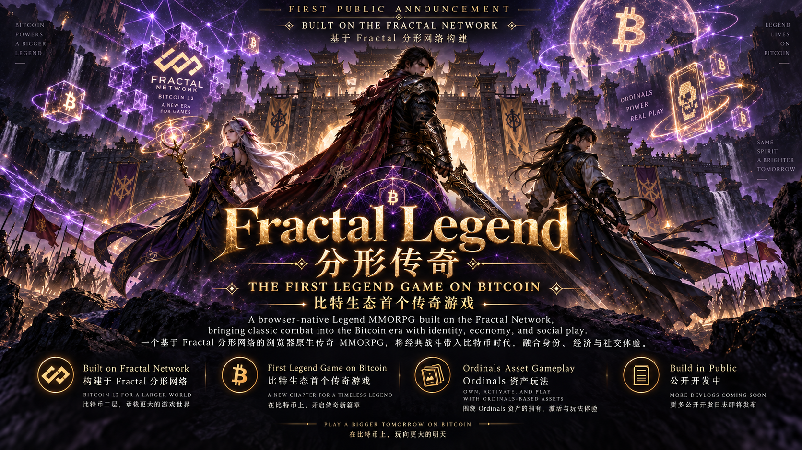

# Fractal Legend / 分形传奇



> **Official promotional artwork. Actual implementation status is documented below.**
>
> **官方宣传画。实际实现状态以本文下方的工程记录为准。**

## English — Primary

**Building toward the first Legend-style MMORPG experience for the Bitcoin / Fractal ecosystem.**

Fractal Legend is a browser-native Legend-style MMORPG being built for the Fractal / Bitcoin ecosystem. Its direction combines classic combat, player-driven economies, digital ownership, Ordinals assets, and a modular social game world.

Development is milestone-driven. The accepted server-authoritative G1–G19 foundation covers world and combat systems, inventory and equipment, PostgreSQL persistence, direct item + FB trade settlement, internal FB and Contribution ledgers, refund recovery, eligible system spend orchestration, internal recycle migration, global emission capacity, and Mining Block reward reservation. This is an engineering foundation, not a public game release.

### Repository role

This repository is the **sanitized public mirror**. It began after G10 with a new Git history and contains only allowlisted, audited material. The private canonical repository remains the authority for complete internal development history, migration references, restricted evidence, and acceptance records.

The public mirror does not copy or reconstruct the private repository history. Earlier milestone SHAs are retained only as plain private archive references in the development history; they are not links and are not commits in this repository.

### Why Fractal / Bitcoin

The long-term design treats Fractal and Bitcoin as more than branding. Ownership, identity, economic rules, and eligible digital assets are intended to connect through explicit verification and game-balance rules. Mainnet wallets, deposits, withdrawals, and Ordinals activation are **not live**.

### Current status

| Capability | Status | Accepted boundary |
|---|---|---|
| G1–G8 gameplay foundations | **FOUNDATION COMPLETE** | World, rendering, entities, combat, AI, one Warrior skill, loot, inventory, equipment, and runtime stats |
| G9 Persistence Foundation | **FOUNDATION COMPLETE** | PostgreSQL Character Aggregate, reconnect, and full Game Server restart restore |
| G10 Trade Foundation | **FOUNDATION COMPLETE** | Secure item-trade domain, extended in G12; no Trade UI |
| G11 FB Ledger Foundation | **FOUNDATION COMPLETE** | Internal server-authoritative ledger; no blockchain, deposit, withdrawal, or wallet |
| G12 Item + FB Trade Settlement | **FOUNDATION COMPLETE** | Atomic PostgreSQL settlement, 0% fee, no Marketplace or blockchain settlement |
| G13 Contribution Ledger | **FOUNDATION COMPLETE** | Internal non-transferable 1:1 eligible-spend ledger; no live spend producer |
| G14 Refund / Reversal Compensation | **FOUNDATION COMPLETE** | Atomic FB + Contribution compensation, recovery debt, hold; no live spend producer |
| G15 Eligible System Spend | **FOUNDATION COMPLETE** | Internal server-owned orchestration; no live gameplay producer |
| G16 Recycle Migration | **FOUNDATION COMPLETE** | Internal item consumption into allowed materials and Reputation; no gameplay recycle entry or production rule |
| G17 Black Iron Emission Pool | **FOUNDATION COMPLETE** | Global capacity only; no player ore, production ratio, mining block, or reward distribution |
| G18 Mining Block Reservation | **FOUNDATION COMPLETE** | Server-owned blocks and atomic reserved capacity; no reward distribution or player ore |
| G19 Black Iron Ore Migration | **FOUNDATION COMPLETE** | Reviewed identity compatibility, 1:1 inventory, immutable provenance; no issuance |
| Complete browser MMORPG | **IN DEVELOPMENT** | Accepted technical slices do not form a public release |
| Wallet / blockchain deposit and withdrawal | **PLANNED** | Not live |
| Ordinals activation | **PLANNED** | No production activation exists |
| Mining, guild, siege, social and media systems | **PLANNED / RESEARCH** | Product direction only |

### Latest accepted milestone

**G19 — Bun → Black Iron Ore Migration Foundation: human acceptance PASS; private Final Close complete.**

G19 establishes canonical Black Iron Ore / 黑铁矿石 (`BLACK_IRON_ORE`) as server-owned game material through explicit reviewed legacy identity compatibility. Definition, legacy and instance IDs, ownership and quantities are preserved. Migration reads locked persisted inventory and converts metadata in place at **1:1**, creating and destroying **zero units**. No client-controlled migration quantities or issuance endpoint exists. Production aliases remain empty; all tested inventories and aliases are synthetic.

One transaction freezes the catalog and commits a version+character immutable COMPLETE receipt plus per-instance provenance. Repeat/restart returns the exact receipt; precommit failure rolls back. Legacy loads and fresh compatibility saves work, stale saves and duplicate representations fail closed. Six real process-kill windows and independently restarted verifier processes cover transaction stages and before/after commit, including lost acknowledgments. No coordinated in-flight COMMIT kill is claimed; item revision overflow relies on atomic database rollback.

Bidirectional read-only reconciliation validates receipt, inventory and provenance, detecting corrupted quantities/receipts, orphan or unmarked assets and missing commitments without silent repair. Catalog/history UPDATE/DELETE/TRUNCATE protection, stale catalog snapshots, aggregate reorder and unrelated trades are tested. Ore ownership transfer/split/consumption is deferred and generic ore trades fail atomically until a reviewed provenance lifecycle exists.

Nonempty economic snapshots with finalized reservations and Recovery Debt remain identical: FB, Contribution, Reputation, Eligible Spend, Capacity, Remaining, Reserved, Distributed, Recovery Debt and immutable mining histories are unchanged. G17 remains the sole capacity authority. Existing inventory migration is separate from future emission and reservation. **New player ore issued: 0.** No production player data was read or migrated.

Human acceptance PASS. Accepted private PR and post-merge canonical CI each passed **6/6 jobs**, Test **619/619**, Race **619/619**, fail **0**, skip **0**, Vet and native Linux/Windows/macOS builds PASS. The public subset has its own independently run checks; private counts are not public test counts.

**NOT IMPLEMENTED:** Production Block Reward; Production Block Duration; Mining Power; Mining Tool; Mining Map; Mining Tool Craft NPC; Hidden Mining Material Map; Player Mining Activity; Production Ore Distribution / Ore Reward Distribution; Production Ore Issuance; Production Emission Ratio; production alias approval and ore gameplay lifecycle.

See [G19 Devlog](docs/devlog/G19-bun-black-iron-migration.md) and [Public Export Allowlist](docs/public-sync/G19-PUBLIC-SYNC-CANDIDATE.md).

### Public source snapshot

The mirror publishes audited project-owned Go domains for AI, Character Stats, Combat Rules, Navigation, registries, PostgreSQL Persistence, G10/G12 Trade, the G11 FB Ledger, G13–G14 Contribution and refund recovery, G15 system spend, G16 recycle, G17 emission capacity, and G18 block reservation. It includes unit tests and versioned schema migrations. It intentionally excludes Legacy seller source, private fixtures, Canonical exports, import tools, protected assets, local-environment integrations, and the complete private runtime assembly.

Run the public Go checks:

```bash
cd apps/game-server
go test ./...
```

See [Public Code Provenance](PUBLIC-CODE-PROVENANCE.md) for the exact publication boundary.

### Public documentation

- [Project Overview](docs/public/PROJECT-OVERVIEW.md)
- [Gameplay](docs/public/GAMEPLAY.md)
- [Web3 & Ordinals](docs/public/WEB3-AND-ORDINALS.md)
- [Economy](docs/public/ECONOMY.md)
- [Current Status](docs/public/CURRENT-STATUS.md)
- [G1–G10 Development Timeline](docs/public/DEVELOPMENT-TIMELINE.md)
- [Public Mirror Development History](docs/public/DEVELOPMENT-HISTORY.md)
- [Roadmap](docs/public/ROADMAP.md)
- [Architecture](docs/public/ARCHITECTURE.md)
- [Build in Public](docs/public/BUILD-IN-PUBLIC.md)
- [Media](docs/public/MEDIA.md)
- [Technical Screenshots](docs/public/SCREENSHOTS.md)
- [FAQ](docs/public/FAQ.md)
- [G9–G19 Devlogs](docs/devlog/)
- [Curated Interaction Records](docs/interactions/)
- [G10 Trade ADR](docs/adr/0009-g10-trade-foundation.md)
- [G11 FB Ledger ADR](docs/adr/0010-g11-fb-ledger-foundation.md)
- [G12 Atomic Settlement ADR](docs/adr/0011-g12-atomic-item-fb-trade-settlement.md)
- [G12 Public Sync Allowlist](docs/public-sync/G12-PUBLIC-SYNC-CANDIDATE.md)
- [G13 Contribution ADR](docs/adr/0012-g13-contribution-ledger-foundation.md)
- [G13 Devlog](docs/devlog/G13-contribution-ledger-foundation.md)
- [G13 Interaction Record](docs/interactions/G13-contribution-ledger-foundation.md)
- [G13 Public Sync Allowlist](docs/public-sync/G13-PUBLIC-SYNC-CANDIDATE.md)
- [G14 Refund ADR](docs/adr/0013-g14-contribution-refund-reversal.md)
- [G14 Devlog](docs/devlog/G14-contribution-refund-reversal.md)
- [G14 Interaction Record](docs/interactions/G14-contribution-refund-reversal.md)
- [G14 Public Sync Allowlist](docs/public-sync/G14-PUBLIC-SYNC-CANDIDATE.md)
- [G15 Devlog](docs/devlog/G15-eligible-system-spend.md)
- [G16 Recycle ADR](docs/adr/0015-g16-recycle-migration-foundation.md)
- [G16 Devlog](docs/devlog/G16-recycle-migration-foundation.md)
- [G16 Interaction Record](docs/interactions/G16-recycle-migration-foundation.md)
- [G16 Public Sync Allowlist](docs/public-sync/G16-PUBLIC-SYNC-CANDIDATE.md)
- [G17 Emission Pool ADR](docs/adr/0016-g17-black-iron-emission-pool.md)
- [G17 Devlog](docs/devlog/G17-black-iron-emission-pool.md)
- [G17 Interaction Record](docs/interactions/G17-black-iron-emission-pool.md)
- [G17 Public Sync Allowlist](docs/public-sync/G17-PUBLIC-SYNC-CANDIDATE.md)
- [G18 Block Reservation ADR](docs/adr/0017-g18-mining-block-reward-reservation.md)
- [G18 Devlog](docs/devlog/G18-mining-block-reward-reservation.md)
- [G18 Interaction Record](docs/interactions/G18-mining-block-reward-reservation.md)
- [G18 Public Sync Allowlist](docs/public-sync/G18-PUBLIC-SYNC-CANDIDATE.md)
- [G13–G15 Timestamp Hardening Devlog](docs/devlog/G13-G15-postgres-timestamp-hardening.md)
- [G13–G15 Timestamp Hardening Interaction Record](docs/interactions/G13-G15-postgres-timestamp-hardening.md)
- [G13–G15 Timestamp Hardening Public Sync Allowlist](docs/public-sync/G13-G15-TIMESTAMP-PUBLIC-SYNC-CANDIDATE.md)
- [Public Mirror Policy](PUBLIC-MIRROR-POLICY.md)
- [Security Policy](SECURITY.md)

### License

A project license has not yet been selected. Public availability of the source does not grant additional reuse rights beyond applicable law.

### Honest limitations

Fractal Legend has no announced public launch date. It is not a production service, mainnet integration, finished browser MMORPG, or investment product. Public artwork communicates product direction; it does not prove gameplay implementation.

---

## 中文 — 完整对应版本

**正在构建面向 Bitcoin / Fractal 生态的首个传奇风格 MMORPG 体验。**

Fractal Legend / 分形传奇是一款正在为 Fractal / Bitcoin 生态构建的浏览器原生传奇风格 MMORPG。项目方向结合经典战斗、玩家驱动经济、数字所有权、Ordinals 资产，以及模块化的社交游戏世界。

开发按里程碑推进。已验收的 Server-authoritative G1–G19 Foundation 覆盖 World 与 Combat 系统、Inventory 与 Equipment、PostgreSQL Persistence、直接 Item + FB Trade Settlement、内部 FB 与 Contribution Ledger、退款恢复、合格 System Spend 编排、内部回收迁移、全服发行额度及 Mining Block 奖励预留。这是一套工程基础，并不代表游戏已经公开上线。

### 仓库定位

本仓库是 **Sanitized Public Mirror**。它在 G10 之后以全新 Git History 建立，只包含通过 Allowlist 和审计的材料。Private Canonical Repository 继续作为完整内部开发历史、迁移参考、受限制证据和验收记录的权威来源。

Public Mirror 不复制或重建 Private Repository History。更早里程碑 SHA 只会在 Development History 中作为纯文本 Private Archive Reference 保留；它们不是链接，也不是本仓库中的 Commit。

### 为什么选择 Fractal / Bitcoin

长期设计不会把 Fractal 和 Bitcoin 只当作品牌标识。Ownership、Identity、Economic Rule 和符合条件的 Digital Asset，计划通过明确的验证流程与 Game Balance Rule 接入游戏。Mainnet Wallet、Deposit、Withdrawal 和 Ordinals Activation **尚未上线**。

### 当前状态

| 能力 | 状态 | 已验收边界 |
|---|---|---|
| G1–G8 Gameplay Foundation | **FOUNDATION COMPLETE** | World、Rendering、Entity、Combat、AI、一项 Warrior Skill、Loot、Inventory、Equipment 与 Runtime Stats |
| G9 Persistence Foundation | **FOUNDATION COMPLETE** | PostgreSQL Character Aggregate、Reconnect 与完整 Game Server Restart Restore |
| G10 Trade Foundation | **FOUNDATION COMPLETE** | 安全 Item Trade Domain，在 G12 得到扩展；不含 Trade UI |
| G11 FB Ledger Foundation | **FOUNDATION COMPLETE** | 内部 Server-authoritative Ledger；不含 Blockchain、Deposit、Withdrawal 或 Wallet |
| G12 Item + FB Trade Settlement | **FOUNDATION COMPLETE** | PostgreSQL 原子结算、0% 手续费；不含 Marketplace 或 Blockchain Settlement |
| G13 Contribution Ledger | **FOUNDATION COMPLETE** | 内部不可转账的 1:1 合格消费账本；尚无真实消费 Producer |
| G14 Refund / Reversal Compensation | **FOUNDATION COMPLETE** | 原子 FB + Contribution 补偿、Recovery Debt 与 Hold；尚无真实消费 Producer |
| G15 Eligible System Spend | **FOUNDATION COMPLETE** | 内部由服务器控制的编排；尚无真实玩法 Producer |
| G16 Recycle Migration | **FOUNDATION COMPLETE** | 内部物品消费、允许材料与 Reputation 产出；没有真实玩法回收入口或生产规则 |
| G17 Black Iron Emission Pool | **FOUNDATION COMPLETE** | 仅建立全服发行额度；不发放玩家矿石，未确定生产比例，也没有 Mining Block 或奖励分配 |
| G18 Mining Block Reservation | **FOUNDATION COMPLETE** | 服务器权威区块与原子容量预留；没有奖励分配或玩家矿石 |
| G19 黑铁矿石迁移 | **FOUNDATION COMPLETE** | 明确身份兼容、1:1 库存及不可变来源；不发行矿石 |
| 完整 Browser MMORPG | **IN DEVELOPMENT** | 已验收 Technical Slice 尚未组成公开 Release |
| Wallet / Blockchain Deposit 与 Withdrawal | **PLANNED** | 尚未上线 |
| Ordinals Activation | **PLANNED** | 不存在 Production Activation |
| Mining、Guild、Siege、Social 与 Media System | **PLANNED / RESEARCH** | 仅为产品方向 |

### 最新已验收里程碑

**G19 — 馒头 → 黑铁矿石迁移基础：人工验收 PASS，私有 Final Close 完成。**

G19 通过明确审查的旧身份兼容，将正式 Black Iron Ore／黑铁矿石（`BLACK_IRON_ORE`）定义为服务器权威游戏材料。定义、旧身份和实例 ID、所有者及数量均保留。迁移读取加锁的持久化库存，原地转换元数据，比例 **1:1**，新增及销毁数量均为 **零**。没有客户端指定迁移数量或发行端点。生产映射保持为空，所有测试库存及映射均为合成数据。

单事务冻结目录，提交版本＋角色不可变 COMPLETE 回执及逐实例来源承诺。重复／重启返回精确回执，提交前失败全部回滚。旧读取和新兼容保存可用，旧 revision 保存及重复表示拒绝。六个真实进程终止窗口和独立重启验证进程覆盖事务阶段及提交前后，包括丢失响应。不声称在正在执行的 COMMIT 内协调终止；实例 revision 溢出依靠数据库原子回滚。

双向只读对账验证回执、库存及来源，发现数量／回执破坏、孤立或无标记资产和缺失承诺，不静默修复。测试覆盖目录／历史 UPDATE／DELETE／TRUNCATE 保护、旧目录快照、聚合排序及其他物品交易。矿石所有权转移／拆分／消耗推迟，在来源生命周期获批前通用矿石交易原子拒绝。

含已完成预留和恢复债务的非空经济快照完全一致：FB、贡献、声望、合格消费、额度、Remaining、Reserved、Distributed、恢复债务及不可变挖矿历史未改变。G17 仍是唯一容量权威来源。既有库存迁移与未来发行和预留分开。**新发行玩家矿石：0。** 没有读取或迁移生产玩家数据。

人工验收 PASS。已验收私有 PR 和合并后 canonical CI 各 **6/6 作业通过**，Test **619/619**、Race **619/619**、失败 **0**、跳过 **0**、Vet 及 Linux／Windows／macOS 原生构建通过。公开子集另行独立验证，私有数量不代表公开测试数量。

**未实现：**正式区块奖励、正式区块时长、挖矿算力、挖矿工具、挖矿地图、工具制作 NPC、隐藏挖矿材料地图、玩家挖矿活动、生产矿石分发／奖励分配、生产矿石发行、生产发行比例、生产映射批准及矿石玩法生命周期。

参见 [G19 Devlog](docs/devlog/G19-bun-black-iron-migration.md) 和[公开导出允许清单](docs/public-sync/G19-PUBLIC-SYNC-CANDIDATE.md)。

### 公开源码快照

本镜像公开经过审计、属于项目自有的 Go Domain，包括 AI、Character Stats、Combat Rules、Navigation、Registry、PostgreSQL Persistence、G10/G12 Trade、G11 FB Ledger、G13–G14 Contribution 与 Refund Recovery、G15 System Spend、G16 Recycle、G17 发行额度及 G18 Block 预留，并包含 Unit Test 与 Versioned Schema Migration。镜像明确排除 Legacy Seller Source、Private Fixture、Canonical Export、Import Tool、受保护 Asset、本地环境 Integration 和完整 Private Runtime Assembly。

运行公开 Go 检查：

```bash
cd apps/game-server
go test ./...
```

准确公开边界详见 [Public Code Provenance](PUBLIC-CODE-PROVENANCE.md)。

### 公开文档

- [项目概览](docs/public/PROJECT-OVERVIEW.md)
- [Gameplay](docs/public/GAMEPLAY.md)
- [Web3 与 Ordinals](docs/public/WEB3-AND-ORDINALS.md)
- [经济](docs/public/ECONOMY.md)
- [当前状态](docs/public/CURRENT-STATUS.md)
- [G1–G10 开发时间线](docs/public/DEVELOPMENT-TIMELINE.md)
- [Public Mirror 开发历史](docs/public/DEVELOPMENT-HISTORY.md)
- [Roadmap](docs/public/ROADMAP.md)
- [Architecture](docs/public/ARCHITECTURE.md)
- [Build in Public](docs/public/BUILD-IN-PUBLIC.md)
- [Media](docs/public/MEDIA.md)
- [Technical Screenshot](docs/public/SCREENSHOTS.md)
- [FAQ](docs/public/FAQ.md)
- [G9–G19 Devlog](docs/devlog/)
- [整理后的 Interaction Record](docs/interactions/)
- [G10 Trade ADR](docs/adr/0009-g10-trade-foundation.md)
- [G11 FB Ledger ADR](docs/adr/0010-g11-fb-ledger-foundation.md)
- [G12 Atomic Settlement ADR](docs/adr/0011-g12-atomic-item-fb-trade-settlement.md)
- [G12 Public Sync Allowlist](docs/public-sync/G12-PUBLIC-SYNC-CANDIDATE.md)
- [G13 Contribution ADR](docs/adr/0012-g13-contribution-ledger-foundation.md)
- [G13 Devlog](docs/devlog/G13-contribution-ledger-foundation.md)
- [G13 Interaction Record](docs/interactions/G13-contribution-ledger-foundation.md)
- [G13 Public Sync Allowlist](docs/public-sync/G13-PUBLIC-SYNC-CANDIDATE.md)
- [G14 Refund ADR](docs/adr/0013-g14-contribution-refund-reversal.md)
- [G14 Devlog](docs/devlog/G14-contribution-refund-reversal.md)
- [G14 Interaction Record](docs/interactions/G14-contribution-refund-reversal.md)
- [G14 Public Sync Allowlist](docs/public-sync/G14-PUBLIC-SYNC-CANDIDATE.md)
- [G15 Devlog](docs/devlog/G15-eligible-system-spend.md)
- [G16 Recycle ADR](docs/adr/0015-g16-recycle-migration-foundation.md)
- [G16 Devlog](docs/devlog/G16-recycle-migration-foundation.md)
- [G16 Interaction Record](docs/interactions/G16-recycle-migration-foundation.md)
- [G16 Public Sync Allowlist](docs/public-sync/G16-PUBLIC-SYNC-CANDIDATE.md)
- [G17 Emission Pool ADR](docs/adr/0016-g17-black-iron-emission-pool.md)
- [G17 Devlog](docs/devlog/G17-black-iron-emission-pool.md)
- [G17 Interaction Record](docs/interactions/G17-black-iron-emission-pool.md)
- [G17 Public Sync Allowlist](docs/public-sync/G17-PUBLIC-SYNC-CANDIDATE.md)
- [G18 区块预留 ADR](docs/adr/0017-g18-mining-block-reward-reservation.md)
- [G18 Devlog](docs/devlog/G18-mining-block-reward-reservation.md)
- [G18 Interaction Record](docs/interactions/G18-mining-block-reward-reservation.md)
- [G18 Public Sync Allowlist](docs/public-sync/G18-PUBLIC-SYNC-CANDIDATE.md)
- [G13–G15 时间持久化硬化 Devlog](docs/devlog/G13-G15-postgres-timestamp-hardening.md)
- [G13–G15 时间持久化硬化 Interaction Record](docs/interactions/G13-G15-postgres-timestamp-hardening.md)
- [G13–G15 时间持久化硬化公开同步清单](docs/public-sync/G13-G15-TIMESTAMP-PUBLIC-SYNC-CANDIDATE.md)
- [Public Mirror Policy](PUBLIC-MIRROR-POLICY.md)
- [Security Policy](SECURITY.md)

### License

项目尚未选择 License。Source 可以公开访问，不代表除适用法律外自动授予额外再使用权利。

### 诚实边界

Fractal Legend 尚未公布公开上线日期。它目前不是 Production Service、Mainnet Integration、完成版 Browser MMORPG 或投资产品。公开宣传画表达产品方向，不能作为 Gameplay 实现证据。
