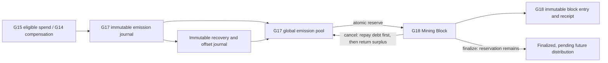

# ADR 0017: G18 Mining Block and Reward Reservation Foundation

Status: **G18 technical and human acceptance PASS; Stage Close complete**

## English — Primary

### Decision and authority

G18 introduces a server-only Mining Block aggregate and a reservation against the **existing G17 global emission pool**. It does not create a second capacity counter. Capacity, reserved reward, distributed reward, and player ore are separate concepts. G18 may reserve capacity; it neither distributes reward nor issues ore. The approved recovery invariant is `net emission capacity = total reserved + total distributed + remaining − recovery debt`. Recovery debt is nonnegative and cannot exceed reserved plus distributed; distribution remains zero in this phase.

An internal service accepts only a create command ID or an existing block ID. The server chooses height, reward, duration, rule version, pool delta, and timestamps. There is no client command route. The only rule, `DEV_G18_FIXED_BLOCK_REWARD`, reserves 10 development emission units for a one-minute development interval. **NOT FINAL PRODUCTION ECONOMICS.** Production mode, an unconfigured rule, and an unknown rule fail closed. Production block reward and duration are both undecided.

### State and transaction model

The persisted states are `OPEN`, `FINALIZED`, and `CANCELLED`. Creating a block opens it immediately. PostgreSQL serializes all pool and block mutations on the G17 singleton pool row. Under that lock, the server computes `max(block_height)+1`; a unique constraint provides a second guard. The block, one reservation row, pool mutation, immutable entry, and immutable receipt commit in one transaction. A repeated create command returns the stored `OPEN` receipt, including after restart. A retry cannot create a second block or spend capacity twice.

Height is allocated from committed block rows while the pool row is locked. An aborted transaction consumes no durable height; cancelled rows remain and their committed heights are never reused. The implementation has no external sequence gap. The contract guarantees unique, monotonically increasing committed heights, **not absolute continuity**. A future sequence implementation may leave unused gaps.

`OPEN → FINALIZED` changes lifecycle state only. Its reward remains reserved and pending future distribution; no G17 `distributed` increment occurs. `OPEN → CANCELLED` atomically releases the full reservation, repays outstanding recovery debt first, then adds any surplus to remaining; immutable block and recovery entries record the complete change. Repeating either terminal command returns the original persisted receipt. An opposite terminal command conflicts. There are no durable intermediate states: a crash before commit rolls back every partial write, while a crash after commit is resolved by exact receipt replay and read-only reconciliation. `Recover` verifies reconciliation before loading the block; it does not silently repair data.

Migration `0010_mining_block_reservation.sql` adds `mining_blocks`, `mining_block_reservations`, `mining_block_entries`, `mining_block_receipts`, and `black_iron_emission_recovery_entries`; it extends the G17 pool with `recovery_debt` and the conservation constraint. It backfills a recovery entry for every existing G17 pool revision, without changing historical G11–G17 entries. Block entries, receipts, and recovery entries have update/delete rejection triggers. Timestamps are written as UTC microseconds and receipts are read back from PostgreSQL for exact first/replay/restart/snapshot equality.

The migration is additive to stored data and tables: it drops no table or column and never updates or deletes an existing ledger row. It replaces the G17 checks that required zero reservations and receipt remaining equal to net pool capacity, because those restrictions cannot represent G18 reservations or recovery debt. A populated 0009 database is tested through 0010 with exact preservation of its G17 entries and receipts.

Reconciliation compares the sum of active block reservations with G17 `total_reserved`, verifies every block/reservation pair, terminal release, entry/receipt cardinality and values, monotonic heights, and pool conservation. It also replays every immutable recovery revision against its authoritative G15/G14 emission or G18 block entry, and checks the resulting pool/debt aggregate. A mismatch is reported without mutation.

### Approved upstream refund and reversal recovery

The user approved **Emission Recovery Debt / Future Offset** for this G18 follow-up. G14 refund/reversal, G17 negative emission compensation, and the recovery audit commit atomically. A negative compensation consumes available remaining capacity; its shortfall increases recovery debt while the block reservation remains intact, even for a finalized block. Later positive emission reduces recovery debt first and only its surplus increases remaining. Cancel releases the reservation, pays debt first, and returns any surplus to remaining. New reservations fail closed while debt is positive; existing create command replay still returns its original receipt. No debt produces player ore, reward distribution, or a second capacity counter.

Every capacity-changing pool revision has one immutable, source-bound recovery entry with net emission, reserved, remaining, and debt deltas. Reconciliation detects forged aggregate state or missing/altered history. The exact long-term production reward and distribution economics remain outside G18; this policy settles only capacity recovery under the approved technical boundary.

### Scope boundary

Implemented in the accepted G18 foundation: state machine, atomic reward reservation and release, immutable compensation history, idempotent receipts, concurrency serialization, PostgreSQL persistence, restart replay, and read-only reconciliation. The accepted private merge and its post-merge CI passed; this sanitized copy has independent public Git history. No miners, participants, mining/hash/tool power, tool or map, player share or reward allocation, ore item or inventory, ore issuance, Bun migration, scheduler, production reward, or production duration is implemented. The database-isolation technical debt remains open. No X publication or G19 work occurred.

## 中文 — 完整审核版

### 决策与权威来源

G18 新增仅供服务器内部使用的 Mining Block 汇总，并从**现有 G17 全服发行池**预留奖励额度。不建立第二套容量计数。发行额度、已预留奖励、已分发奖励和玩家矿石是不同概念。G18 只可预留容量，不分配奖励，也不发放矿石。批准后的池守恒式为“净发行额度 = 已预留 + 已分发 + 剩余 − 恢复债务”；债务非负，不超过已预留与已分发之和。本阶段已分发始终为零。

架构链：G15 合格消费／G14 补偿 → G17 不可变发行流水及不可变债务冲抵流水 → G17 全服发行池 → G18 原子预留并开启 Block → G18 不可变 Block 流水与回执。取消时先偿还恢复债务，再将剩余额度返回发行池；完成时 Block 保留预留，等待未来独立的分配阶段。

内部 Service 仅接收创建命令 ID 或既有 Block ID。高度、奖励量、时长、规则版本、池变化和时间戳均由服务器确定，没有客户端命令入口。唯一开发规则 `DEV_G18_FIXED_BLOCK_REWARD` 使用 10 个开发发行单位和一分钟开发时长，**不是最终生产经济参数**。生产模式、未配置规则和未知规则均拒绝。正式 Block Reward 与 Block Duration 均未确定。

### 状态与事务模型

持久状态为 `OPEN`、`FINALIZED`、`CANCELLED`。创建 Block 即直接开启。PostgreSQL 对 G17 单例池行加锁，串行处理所有池和 Block 变更；持锁时由服务器计算 `max(block_height)+1`，唯一约束提供第二道保护。Block、单条预留记录、池变更、不可变流水和不可变回执在同一事务提交。同一创建命令重复执行，包括重启后，返回原始 `OPEN` 回执，不会再次创建 Block 或扣减容量。

高度在持有池行锁时从已提交 Block 行计算。回滚的事务不占用持久高度；取消的 Block 行仍保留，已提交高度不会复用。当前实现没有外部 Sequence 跳号。契约保证已提交高度唯一、单调递增，**不保证绝对连续**；未来若改用 Sequence，允许出现未使用的跳号。

`OPEN → FINALIZED` 只改变生命周期状态；奖励保持预留并等待未来分配，不增加 G17 `distributed`。`OPEN → CANCELLED` 原子释放全部预留，先偿还债务，再将剩余额度归还 Remaining，并追加不可变 Block 与恢复流水。重复 Finalize 或 Cancel 返回原回执，反向终态命令报冲突。没有持久的中间状态：提交前崩溃使所有部分写入回滚，提交后崩溃通过精确回执重放及只读对账恢复。`Recover` 先验证对账再读取 Block，不静默修复。

迁移 `0010_mining_block_reservation.sql` 新增 `mining_blocks`、`mining_block_reservations`、`mining_block_entries`、`mining_block_receipts` 及 `black_iron_emission_recovery_entries`，为 G17 池增加 `recovery_debt` 与守恒约束，并对既有 G17 池修订补录对应恢复流水；G11–G17 原有流水不变。Block 流水、回执及恢复流水用 Trigger 禁止更新和删除。时间戳采用 UTC 微秒，返回的回执从 PostgreSQL 重读，支持首次、重放、重启和快照精确相等。

迁移对存储数据与表结构作加法扩展：不删除表或字段，也不更新或删除既有账本行。为表示 G18 预留与恢复债务，迁移替换 G17 原先要求预留恒为零、回执 Remaining 等于净池容量的限制性 CHECK。非空 0009 数据库升级至 0010 的测试验证 G17 原流水与回执完全保留。

对账比对有效 Block 预留总和与 G17 `total_reserved`，核查每个 Block 与预留配对、终态释放、流水／回执数量及值、单调高度和池守恒，并逐条对照 G15/G14 权威发行或 G18 Block 流水重放债务冲抵记录与最终池状态。发现不符只报告，不写入修复。

### 已批准的上游退款／冲正恢复模型

用户在 G18 后续指令中批准 **Emission Recovery Debt / Future Offset**。G14 退款／冲正、G17 负发行补偿及恢复审计流水同事务提交。负补偿先消耗 Remaining，缺口增加恢复债务；已预留 Block 的额度保持不变，已完成 Block 亦然。未来正发行先抵扣债务，余量才增加 Remaining。Cancel 完整释放预留，先偿还债务，剩余才返还 Remaining。债务未清前拒绝创建新的预留；已有创建命令重放仍返回原回执。债务不会生成玩家矿石、奖励分配或第二套容量计数。

每个改变池容量的修订都有一条绑定权威源的不可变恢复流水，记录净发行、预留、剩余及债务变化。对账会发现伪造的池汇总或缺失／篡改的历史。长期正式奖励和分配经济仍属于 G18 范围之外；本规则只解决经用户批准的技术容量恢复问题。

### 范围边界

已验收的 G18 基础包含状态机、原子奖励预留与释放、不可变补偿历史、幂等回执、并发串行化、PostgreSQL 持久化、重启重放和只读对账。私有合并及其合并后的 CI 均已通过；此脱敏副本保持独立的公开 Git 历史。没有实现 Miner、Participant、挖矿／哈希／工具算力、工具、地图、玩家份额或奖励分配、矿石物品或库存、矿石发放、馒头迁移、Scheduler、正式奖励或正式时长。测试数据库隔离技术债仍开放。没有发布 X 或开展 G19 工作。
