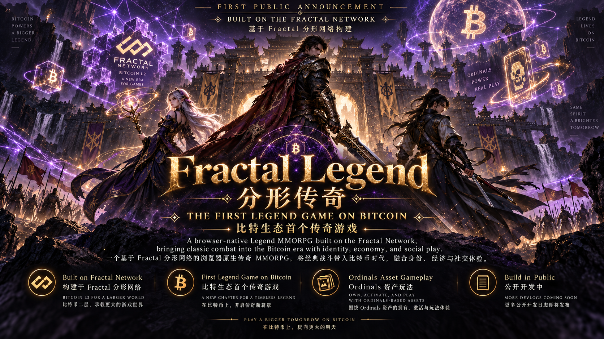

# Media / 媒体素材

## English — Primary

### Official launch poster

**Official promotional artwork. Actual implementation status is documented in [Current Status](CURRENT-STATUS.md).**

This image communicates the intended Fractal / Bitcoin setting, Legend-style fantasy direction, Ordinals vision, and Build in Public identity. It is marketing artwork, not an actual gameplay screenshot, runtime capture, test result, or proof that planned systems are live.

- Asset: [fractal-legend-launch-poster.png](assets/marketing/fractal-legend-launch-poster.png)
- Integrity: [SHA256SUMS.txt](assets/marketing/SHA256SUMS.txt)
- Dimensions: 1672 × 941 pixels
- Color mode: RGB

### Official gameplay trailer

Coming later, after mature real gameplay footage is available. No date is announced and no video file is included or linked here.

Technical validation screenshots remain separate from marketing assets and are listed in [Technical Screenshots](SCREENSHOTS.md).

---

## 中文 — 完整对应版本

### 官方首发宣传画

**官方宣传画。实际实现状态记录在[当前状态](CURRENT-STATUS.md)中。**

该图片表达目标中的 Fractal / Bitcoin 背景、传奇风格幻想方向、Ordinals 愿景与 Build in Public 身份。它是 Marketing Artwork，不是实际 Gameplay Screenshot、Runtime Capture、Test Result，也不能证明规划系统已经上线。

- 素材：[fractal-legend-launch-poster.png](assets/marketing/fractal-legend-launch-poster.png)
- 完整性：[SHA256SUMS.txt](assets/marketing/SHA256SUMS.txt)
- 尺寸：1672 × 941 像素
- Color Mode：RGB

### 官方 Gameplay Trailer

将在成熟的真实 Gameplay Footage 可用后再准备。目前没有公布日期，本页没有包含或链接任何视频文件。

Technical Validation Screenshot 与 Marketing Asset 保持分离，详见 [Technical Screenshot](SCREENSHOTS.md)。
