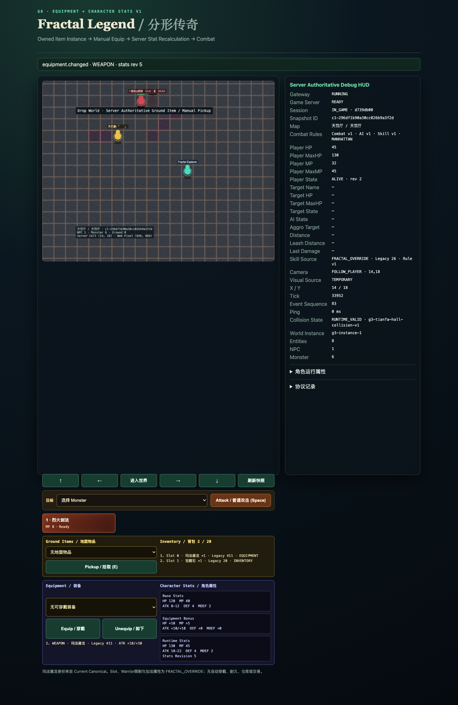
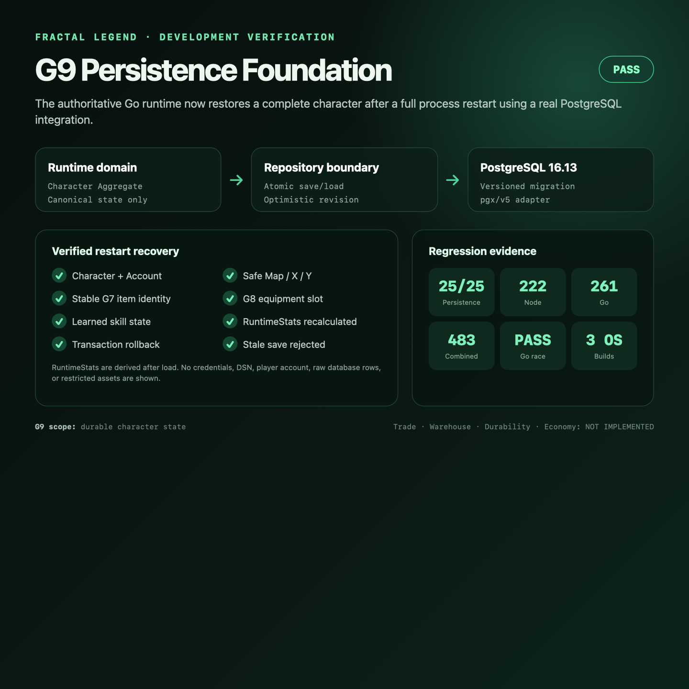
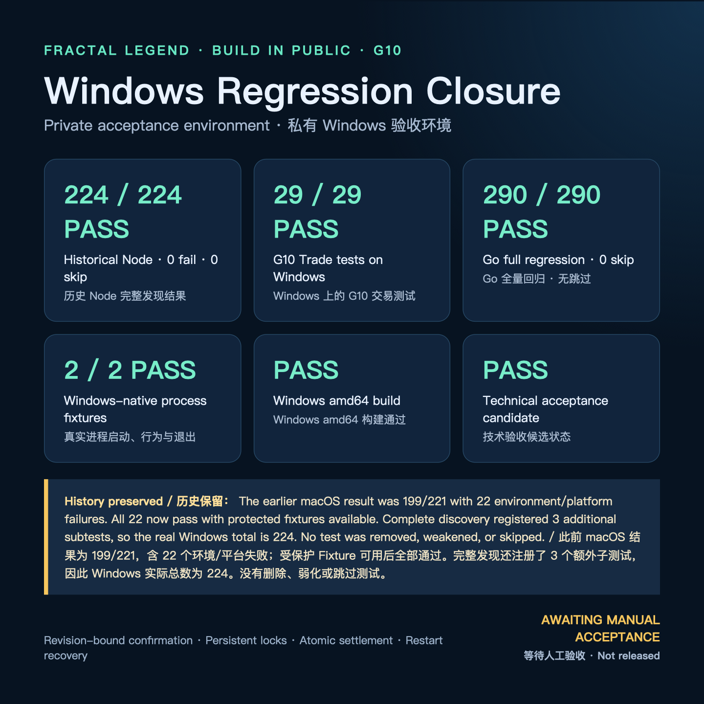
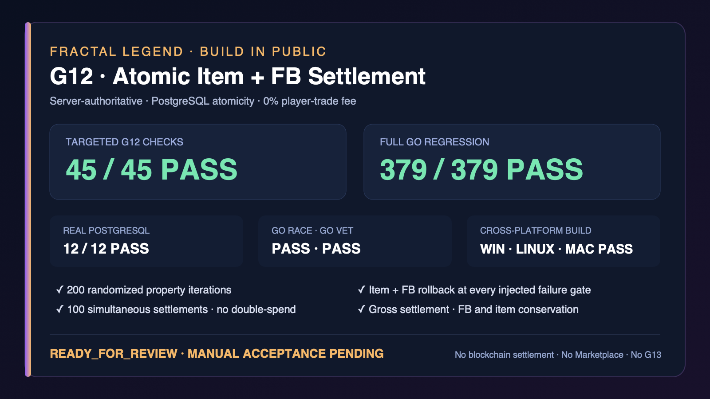
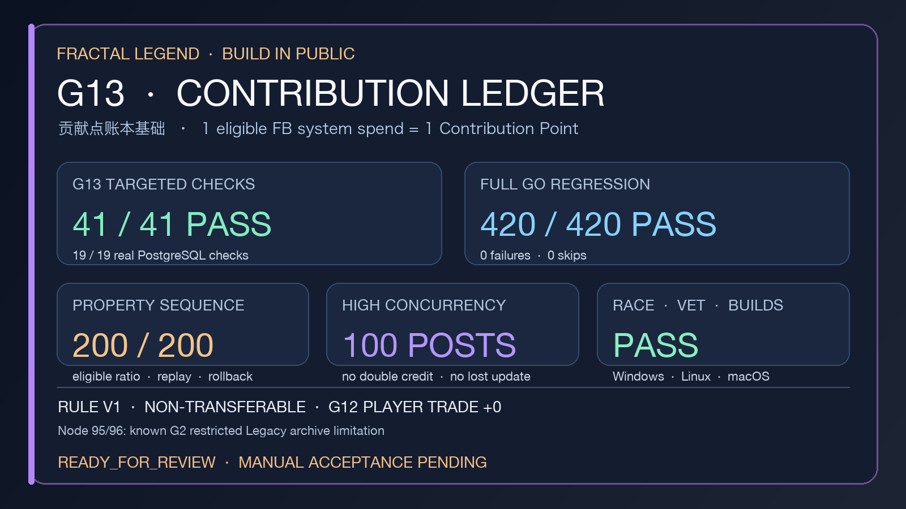
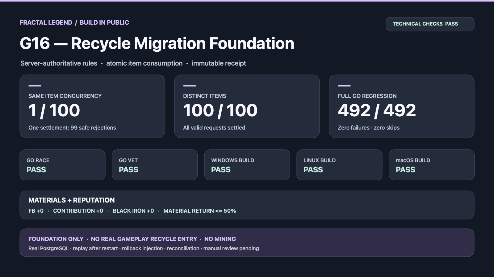

# Technical Screenshots / 技术截图

## English — Primary

These approved screenshots summarize accepted engineering milestones. They contain no credential, account identifier, private path, database address, restricted Legacy asset, or private fixture. They are technical validation material, not proof of a production release.

### G8 — Equipment Runtime and Character Stats

Summary: equipment instance identity, equip/unequip rules, RuntimeStats, reconnect behavior, concurrency checks, and the recorded 456/456 combined result.

### G9 — Persistence Foundation

Summary: PostgreSQL Character Aggregate, optimistic revision, reconnect restore, complete Game Server restart restore, and the recorded 483/483 combined result.

### G10 — Trade Foundation

Historical context: this card was captured after the Windows regression closed but before final manual acceptance, so the image correctly says “AWAITING MANUAL ACCEPTANCE.” The later manual gate passed and G10 is now CLOSED / PASS. It is retained to preserve the actual verification sequence.

### G12 — Atomic Item + FB Trade Settlement

Historical context: this sanitized verification card was captured before manual acceptance and therefore says `READY_FOR_REVIEW · MANUAL ACCEPTANCE PENDING`. G12 technical acceptance later passed. It records 45/45 targeted checks, 12/12 real PostgreSQL checks, 379/379 full Go regression, Race and Vet, 200 property iterations, 100 simultaneous settlements, and Windows/Linux/macOS builds. It does not imply a product release. SHA-256: `161e2493863bb1c2cc93de35508529f713dc3ea35af76d3bbed8749b28d94517`.

### G13 — Contribution Ledger Foundation

Historical context: this sanitized card was captured before manual acceptance, so it says `READY_FOR_REVIEW · MANUAL ACCEPTANCE PENDING`. G13 technical and manual acceptance later passed. It records 41/41 targeted checks, 19/19 real PostgreSQL checks, 420/420 full Go regression, Race and Vet, 200 property iterations, 100-way concurrency, three-platform builds, and the known G2 Node 95/96 limitation. It is not release evidence. SHA-256: `cae1f1a2985a4c8f7ce954310b013c6529c9370ef30e33664ad78fe3c5ba250c`.

### G16 — Recycle Migration Foundation

Historical context: this card records the initial local 492/492 Go result and was made before manual review, so it still says “manual review pending.” The later GitHub Actions run found a PostgreSQL timestamp replay mismatch; after repair, final CI passed 6/6 jobs with normal and Race 492/492 each and zero skips. The image is retained as technical material for a later combined update, not as a standalone X post or release evidence. SHA-256: `705ba7065dee929392b44f5aee1d7ef9ad3dc918e0b7cdc9e337ee93034598c2`.

---

## 中文 — 完整对应版本

这些已批准 Screenshot 用于总结已经验收的 Engineering Milestone。它们不包含 Credential、Account Identifier、Private Path、Database Address、受限制 Legacy Asset 或 Private Fixture。它们是 Technical Validation Material，不是 Production Release 证明。

### G8 — Equipment Runtime and Character Stats

摘要：Equipment Instance Identity、Equip/Unequip Rule、RuntimeStats、Reconnect Behavior、Concurrency Check，以及记录的 456/456 Combined Result。

### G9 — Persistence Foundation

摘要：PostgreSQL Character Aggregate、Optimistic Revision、Reconnect Restore、完整 Game Server Restart Restore，以及记录的 483/483 Combined Result。

### G10 — Trade Foundation

历史背景：该 Card 截取于 Windows Regression 关闭之后、最终人工验收之前，因此图片准确显示“AWAITING MANUAL ACCEPTANCE”。之后的 Manual Gate 已通过，G10 当前为 CLOSED / PASS。保留该图是为了如实呈现验证顺序。

### G12 — Atomic Item + FB Trade Settlement

历史背景：该脱敏 Verification Card 截取于人工验收前，因此显示 `READY_FOR_REVIEW · MANUAL ACCEPTANCE PENDING`。之后 G12 技术验收已通过。图片记录了专项检查 45/45、真实 PostgreSQL 检查 12/12、Go 完整回归 379/379、Race 与 Vet、200 轮 Property Iteration、100 个同时 Settlement，以及 Windows/Linux/macOS Build。它不代表产品 Release。SHA-256：`161e2493863bb1c2cc93de35508529f713dc3ea35af76d3bbed8749b28d94517`。

### G13 — Contribution Ledger Foundation

历史背景：该脱敏卡片截取于人工验收前，因此显示 `READY_FOR_REVIEW · MANUAL ACCEPTANCE PENDING`。G13 技术验收与人工验收此后均已通过。它记录专项检查 41/41、真实 PostgreSQL 检查 19/19、Go 完整回归 420/420、Race 与 Vet、200 轮 Property Iteration、100 并发、三平台 Build，以及已知 G2 Node 95/96 限制。它不是 Release 证据。SHA-256：`cae1f1a2985a4c8f7ce954310b013c6529c9370ef30e33664ad78fe3c5ba250c`。

### G16 — Recycle Migration Foundation

历史背景：该卡记录最初本地 Go 492/492 结果，制作于人工验收前，因此仍显示“manual review pending”。之后 GitHub Actions 发现 PostgreSQL 时间重放差异；修复后最终 CI 6/6 Jobs 通过，普通与 Race 各 492/492、零跳过。该图保留为后续集合更新的技术素材，不是 G16 单独 X 推文或 Release 证据。SHA-256：`705ba7065dee929392b44f5aee1d7ef9ad3dc918e0b7cdc9e337ee93034598c2`。
